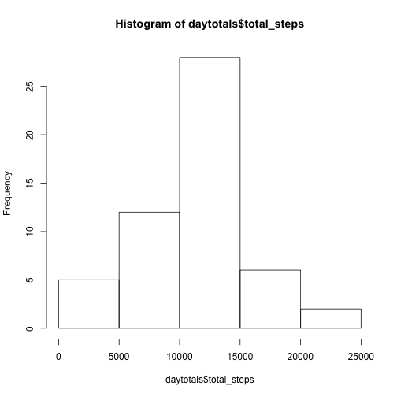
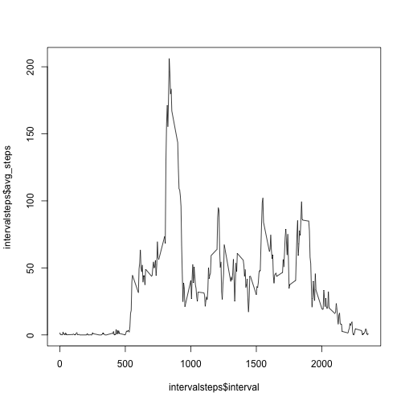
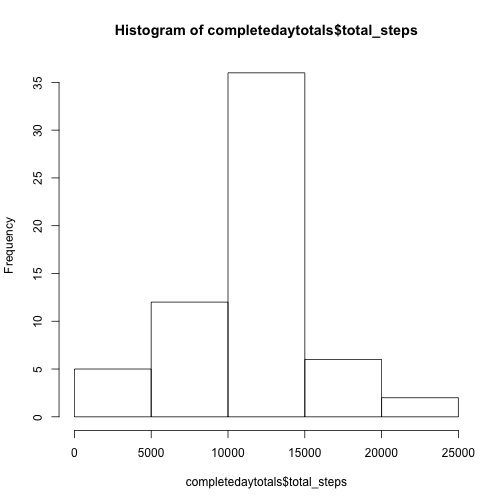
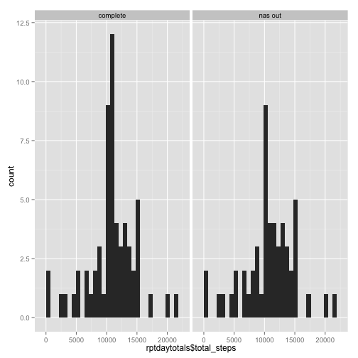
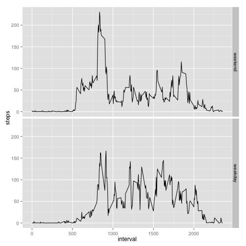

(Instructions from the assignment are in italics)
### Loading and preprocessing

First, we open the data file and drop the NAs


```r
setwd("~/datacourse/Reproducible Research/RepData_PeerAssessment1/")
library(dplyr)
library(ggplot2)
par(mfrow = c(1,1))
activity <- read.csv("data/activity.csv")
complete <- activity[complete.cases(activity), ]
```


### What is mean total number of steps taken per day?

First we calculate the statistical summaries ... started with tapply
(daytotals <- tapply(activity\$steps, activity\$date, sum)) but have become spoilt
by dplyr

Then we also calculate out the mean and median total number of steps per day.


```r
daytotals <- complete %>% group_by(date) %>% summarise(total_steps = sum(steps))

hist(daytotals$total_steps)
```

 

```r
print(paste("Mean daily steps: ", mean(daytotals$total_steps)))
```

```
## [1] "Mean daily steps:  10766.1886792453"
```

```r
print(paste("Median daily steps: ", median(daytotals$total_steps)))
```

```
## [1] "Median daily steps:  10765"
```


### What is the average daily activity pattern?

So now let's make a different table to play with summarising average steps by interval.
The line plot is simple and follows.  We'll extract the single interval with the
maximum number of steps at the end.


```r
intervalsteps <- complete %>% group_by(interval) %>% summarise(avg_steps = mean(steps))
plot(intervalsteps$interval, intervalsteps$avg_steps, type = "l")
```

 

```r
print(paste("The interval with the highest average number of steps is: ",
            intervalsteps[which.max(intervalsteps$avg_steps),1]))
```

```
## [1] "The interval with the highest average number of steps is:  835"
```


### Imputing missing values

1. _Calculate and report the total number of missing values in the dataset (i.e. the total number of rows with `NA`s)_


```r
nas <- activity[is.na(activity$steps),]
narows <- nrow(nas)
print(paste("The number of missing rows is:", narows))
```

```
## [1] "The number of missing rows is: 2304"
```


2. _Devise a strategy for filling in all of the missing values in the dataset. The strategy does not need to be sophisticated. For example, you could use the mean/median for that day, or the mean for that 5-minute interval, etc._

(I chose to go wtih the mean for that interval since it was right there.  But to keep things tidy, I made it
look like an integer)


```r
nas <- left_join(nas, intervalsteps, by = "interval")
nas$steps <- round(nas$avg_steps, 0)
```


3. _Create a new dataset that is equal to the original dataset but with the missing data filled in._

```r
merged <- bind_rows(complete, nas)
```

4. _Make a histogram of the total number of steps taken each day and Calculate and report the **mean** and **median** total number of steps taken per day. Do these values differ from the estimates from the first part of the assignment? What is the impact of imputing missing data on the estimates of the total daily number of steps?_


```r
completedaytotals <- merged %>% group_by(date) %>% summarise(total_steps = sum(steps))

hist(completedaytotals$total_steps)
```

 

```r
print(paste("Mean daily steps: ", mean(completedaytotals$total_steps)))
```

```
## [1] "Mean daily steps:  10765.6393442623"
```

```r
print(paste("Median daily steps: ", median(completedaytotals$total_steps)))
```

```
## [1] "Median daily steps:  10762"
```

Let's compare:


```r
completedaytotals$type <- 'complete'
daytotals$type <- 'nas out'
rptdaytotals <- bind_rows(completedaytotals, daytotals)

ggplot(data = rptdaytotals, aes(rptdaytotals$total_steps)) + geom_histogram() + facet_grid(. ~ type)
```

```
## stat_bin: binwidth defaulted to range/30. Use 'binwidth = x' to adjust this.
## stat_bin: binwidth defaulted to range/30. Use 'binwidth = x' to adjust this.
```

 

```r
rm(rptdaytotals)
```


### Are there differences in activity patterns between weekdays and weekends?

_1. Create a new factor variable in the dataset with two levels -- "weekday" and "weekend" indicating whether a given date is a weekday or weekend day._


```r
merged$weekend <- ifelse((weekdays(as.POSIXct(merged$date)) == "Saturday") | 
                         (weekdays(as.POSIXct(merged$date)) == "Sunday"), TRUE, FALSE)
merged$weekend <- factor(merged$weekend,labels = c("weekend", "weekday"))
```


_2. Make a panel plot containing a time series plot (i.e. `type = "l"`) of the 5-minute interval (x-axis) and the average number of steps taken, averaged across all weekday days or weekend days (y-axis)._


```r
intervalwk <- merged %>% group_by(weekend, interval) %>% summarise(mean(steps))
names(intervalwk)[3] <- 'steps'
ggplot(intervalwk, aes(x = interval, y = steps)) + geom_line() + facet_grid(weekend~.)
```

 

